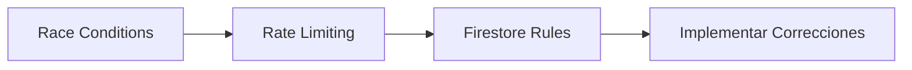
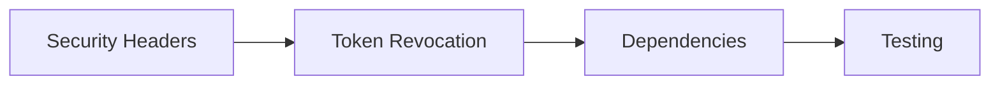

# 📚 RESUMEN: Todos los Prompts Disponibles para Gemini

Tienes **9 prompts especializados** listos para usar con Gemini Pro en auditorías de seguridad.

---

## 🎯 Prompts Principales (Ya Existían)

### 1. 🔐 Autenticación y Autorización
**Archivo**: [prompt-auth-audit.md](prompt-auth-audit.md)

**Detecta**:
- JWT con secrets débiles
- Escalación de privilegios
- Manejo inseguro de sesiones
- Exposición de datos sensibles en respuestas

**Cuándo usar**: Auditar `auth.js`, `authController.js`, middleware de roles

---

### 2. 💉 Inyecciones (NoSQL, XSS, SSRF)
**Archivo**: [prompt-injection-audit.md](prompt-injection-audit.md)

**Detecta**:
- NoSQL injection (Firestore, MongoDB)
- XSS (Cross-Site Scripting)
- SSRF (Server-Side Request Forgery)
- Command Injection

**Cuándo usar**: Auditar rutas, controladores, servicios con inputs de usuario

---

### 3. 💰 Lógica de Negocio Financiera
**Archivo**: [prompt-business-logic-audit.md](prompt-business-logic-audit.md)

**Detecta**:
- Race conditions en operaciones financieras
- Lógica de negocio vulnerable
- Ataques TOCTOU (Time-Of-Check-Time-Of-Use)
- Mass assignment

**Cuándo usar**: Auditar controladores financieros, operaciones de estado crítico

---

## 🆕 Prompts Nuevos (Recién Creados)

### 4. 🔄 Race Conditions Específicas
**Archivo**: [prompt-race-condition-audit.md](prompt-race-condition-audit.md)

**Detecta**:
- Operaciones Read-Check-Update NO atómicas
- Estados críticos modificados sin transacciones
- Cálculos financieros sin `db.runTransaction()`
- Duplicación de notificaciones/reportes

**Cuándo usar**: Auditar `rutaController.js`, `cargadoresController.js`, funciones de estado

**Ejemplo de uso**:
```bash
# 1. Abre el archivo del prompt
cat .security-audit/prompt-race-condition-audit.md

# 2. Copia TODO el contenido

# 3. Pega en Gemini Pro

# 4. Copia el código a auditar
cat backend/src/controllers/cargadoresController.js

# 5. Pega en Gemini

# 6. Gemini generará reporte con vulnerabilidades
```

---

### 5. 🚦 Rate Limiting y DoS
**Archivo**: [prompt-rate-limiting-audit.md](prompt-rate-limiting-audit.md)

**Detecta**:
- Endpoints sin rate limiting
- Configuraciones muy permisivas
- Falta de límites por usuario (solo por IP)
- Endpoints críticos desprotegidos (login, upload, email)

**Cuándo usar**: Auditar TODAS las rutas (`backend/src/routes/*.js`)

**Límites recomendados que Gemini sugerirá**:
- Login: 5-10 intentos / 15 min
- Registro: 3-5 registros / hora
- Upload: 10-20 archivos / hora
- Emails: 5-10 emails / hora
- APIs generales: 100-500 / 15 min

---

### 6. 🔥 Firestore Security Rules
**Archivo**: [prompt-firestore-rules-audit.md](prompt-firestore-rules-audit.md)

**Detecta**:
- Reglas completamente abiertas (`allow read, write: if true`)
- Colecciones sin autenticación
- Falta de aislamiento por `companyId`
- Validación de roles ausente
- Escritura sin validar campos críticos

**Cuándo usar**:
- AHORA si tus reglas están en modo desarrollo
- Cada vez que agregues una colección
- Mensualmente como auditoría

**Input que necesita Gemini**:
```javascript
// Ve a Firebase Console > Firestore Database > Rules
// Copia TODAS las reglas y pégalas en Gemini

rules_version = '2';
service cloud.firestore {
  match /databases/{database}/documents {
    match /{document=**} {
      allow read, write: if true;  // ❌ Gemini detectará esto
    }
  }
}
```

---

## 🎯 Prompts Inline (No requieren archivo)

### 7. 🛡️ Security Headers

**Qué detecta**:
- Ausencia de Helmet.js
- CORS mal configurado (`origin: '*'`)
- Headers faltantes (CSP, X-Frame-Options, HSTS)

**Prompt corto para Gemini**:
```
Audita este archivo de configuración Express para detectar:
1. Helmet.js NO configurado
2. CORS con origin: '*'
3. Headers de seguridad faltantes

Genera reporte con código de corrección usando Helmet.js

[PEGA AQUÍ backend/src/app.js]
```

---

### 8. 📦 Dependencias Vulnerables

**Qué detecta**:
- Dependencias con CVEs conocidos
- Versiones desactualizadas
- Paquetes deprecados

**Prompt corto para Gemini**:
```
Analiza este package.json para detectar dependencias con vulnerabilidades:

Prioriza:
- express, firebase-admin, jsonwebtoken
- bcrypt, cors, multer, axios

Para cada vulnerabilidad, indica:
- CVE, severidad, versión afectada
- Comando de corrección

[PEGA AQUÍ package.json]
```

**Alternativa más rápida**:
```bash
npm audit
npm audit fix
```

---

### 9. 🔑 Token Revocation

**Qué detecta**:
- Logout sin revocar tokens
- Middleware sin verificar revocación
- Falta de blacklist de tokens

**Prompt corto para Gemini**:
```
Audita este sistema de autenticación para detectar ausencia de revocación de tokens.

Busca:
1. Función logout que NO revoca tokens
2. verifyToken que NO verifica revocación
3. Falta de blacklist en Firestore

Genera código de corrección usando:
- admin.auth().revokeRefreshTokens(uid)
- verifyIdToken(token, true) // checkRevoked

[PEGA AQUÍ backend/src/middleware/auth.js]
```

---

## 📊 Tabla Comparativa de Prompts

| Prompt | Archivo | Severidades que Detecta | Tiempo de Auditoría | Complejidad |
|--------|---------|-------------------------|---------------------|-------------|
| Auth Audit | [prompt-auth-audit.md](prompt-auth-audit.md) | CRÍTICA, ALTA | 30-45 min | Media |
| Injection Audit | [prompt-injection-audit.md](prompt-injection-audit.md) | CRÍTICA, ALTA | 30-45 min | Media |
| Business Logic | [prompt-business-logic-audit.md](prompt-business-logic-audit.md) | ALTA, MEDIA | 45-60 min | Alta |
| Race Condition | [prompt-race-condition-audit.md](prompt-race-condition-audit.md) | MEDIA, ALTA | 30-45 min | Alta |
| Rate Limiting | [prompt-rate-limiting-audit.md](prompt-rate-limiting-audit.md) | CRÍTICA, ALTA | 45-60 min | Baja |
| Firestore Rules | [prompt-firestore-rules-audit.md](prompt-firestore-rules-audit.md) | CRÍTICA | 60-90 min | Media |
| Security Headers | (Inline) | MEDIA | 20-30 min | Baja |
| Dependencies | (Inline) | VARIABLE | 15-20 min | Muy Baja |
| Token Revocation | (Inline) | ALTA | 30-40 min | Media |

---

## 🚀 Workflow Recomendado

### Fase 1: Vulnerabilidades Críticas (Esta Semana)



**Orden**:
1. **Race Condition Audit** → `rutaController.js`, `cargadoresController.js`
2. **Rate Limiting Audit** → Todas las rutas en `backend/src/routes/`
3. **Firestore Rules Audit** → Copiar reglas desde Firebase Console

**Tiempo total**: 3-5 horas de auditoría + 8-12 horas de implementación

---

### Fase 2: Mejoras de Seguridad (Próxima Semana)



**Orden**:
4. **Security Headers Audit** → `app.js`, `server.js`
5. **Token Revocation Audit** → `auth.js`, `authController.js`
6. **Dependency Audit** → `package.json` (o usar `npm audit`)

**Tiempo total**: 2-3 horas de auditoría + 4-6 horas de implementación

---

### Fase 3: Auditorías Existentes (Si No Las Hiciste)

7. **Auth Audit** → `middleware/auth.js`
8. **Injection Audit** → `routes/*.js`
9. **Business Logic Audit** → `controllers/*.js`

**Tiempo total**: 2-3 horas de auditoría + tiempo variable de correcciones

---

## 📝 Instrucciones de Uso Generales

### Para TODOS los prompts:

1. **Abre el archivo del prompt** (o copia el inline)
2. **Copia TODO el contenido** del prompt
3. **Pega en Gemini Pro** (AnythingLLM o Google AI Studio)
4. **Espera confirmación** de Gemini ("Entendido, estoy listo para auditar...")
5. **Copia el código a auditar** (archivo completo)
6. **Pega en Gemini**
7. **Gemini generará reporte** en formato Markdown
8. **Guarda el reporte** en `.security-audit/reportes/`
9. **Implementa las correcciones** sugeridas
10. **Vuelve a auditar** para validar que se corrigió

---

## 🎯 Quick Start: Próximas 3 Auditorías

### 1️⃣ Auditar Race Conditions en `cargadoresController.js`

```bash
# Paso 1: Ver el prompt
cat .security-audit/prompt-race-condition-audit.md

# Paso 2: Copiar TODO y pegar en Gemini

# Paso 3: Copiar código a auditar
cat backend/src/controllers/cargadoresController.js

# Paso 4: Pegar en Gemini y esperar reporte
```

**Tiempo**: 30-45 minutos

---

### 2️⃣ Auditar Rate Limiting en Rutas

```bash
# Paso 1: Ver el prompt
cat .security-audit/prompt-rate-limiting-audit.md

# Paso 2: Copiar TODO y pegar en Gemini

# Paso 3: Copiar TODAS las rutas
cat backend/src/routes/contenedores.js
cat backend/src/routes/usuarios.js
# ... etc

# Paso 4: Pegar UNA POR UNA en Gemini
```

**Tiempo**: 45-60 minutos (15 min por archivo de ruta)

---

### 3️⃣ Auditar Firestore Rules

```bash
# Paso 1: Ir a Firebase Console
# https://console.firebase.google.com
# -> Firestore Database -> Rules

# Paso 2: Copiar TODAS las reglas

# Paso 3: Ver el prompt
cat .security-audit/prompt-firestore-rules-audit.md

# Paso 4: Copiar TODO y pegar en Gemini

# Paso 5: Pegar las reglas de Firestore en Gemini

# Paso 6: Implementar reglas seguras que Gemini genere
```

**Tiempo**: 60-90 minutos

---

## 📂 Estructura de Archivos de Prompts

```
.security-audit/
├── README.md                              # Documentación general
├── GUIA-PROMPTS-SIGUIENTES-PASOS.md      # Guía de próximos pasos
├── RESUMEN-PROMPTS-DISPONIBLES.md         # Este archivo
├── CHANGELOG-SECURITY.md                  # Registro de cambios
├── RESUMEN-FINAL-SEGURIDAD.md             # Resumen ejecutivo
│
├── prompt-auth-audit.md                   # ✅ Prompt #1
├── prompt-injection-audit.md              # ✅ Prompt #2
├── prompt-business-logic-audit.md         # ✅ Prompt #3
├── prompt-race-condition-audit.md         # 🆕 Prompt #4
├── prompt-rate-limiting-audit.md          # 🆕 Prompt #5
├── prompt-firestore-rules-audit.md        # 🆕 Prompt #6
│
├── security-audit-auto.js                 # Script de automatización
├── install-git-hook.sh                    # Git hook installer
│
└── reportes/                              # Reportes generados
    ├── race-condition-fix-2025-12-24.md
    └── [otros reportes]
```

---

## 🎓 Tips para Mejores Resultados con Gemini

### ✅ Buenas Prácticas

1. **Copia TODO el prompt**, no solo una parte
2. **Espera confirmación** de Gemini antes de pegar código
3. **Pega código completo**, no fragmentos (Gemini necesita contexto)
4. **Un archivo a la vez**, no múltiples archivos en una sola auditoría
5. **Guarda los reportes** en `.security-audit/reportes/`
6. **Implementa las correcciones** antes de la siguiente auditoría

### ❌ Evitar

1. ❌ Pegar código sin pegar el prompt primero
2. ❌ Pegar fragmentos de código (Gemini necesita ver funciones completas)
3. ❌ Auditar múltiples archivos simultáneamente (genera reportes confusos)
4. ❌ Ignorar las correcciones de severidad CRÍTICA
5. ❌ No validar que las correcciones funcionan

---

## 📊 Seguimiento de Auditorías

### Checklist de Auditorías Completadas

**Fase 1: Críticas**
- [ ] Race Conditions en `rutaController.js` (✅ YA CORREGIDA)
- [ ] Race Conditions en `cargadoresController.js`
- [ ] Race Conditions en `almacenUsaController.js`
- [ ] Rate Limiting en `contenedores.js`
- [ ] Rate Limiting en `usuarios.js`
- [ ] Rate Limiting en `auth.js`
- [ ] Firestore Security Rules

**Fase 2: Altas**
- [ ] Security Headers en `app.js`
- [ ] Token Revocation en `auth.js`
- [ ] Dependency Audit (`package.json`)

**Fase 3: Complementarias**
- [x] Auth Audit (implementado 2025-12-23)
- [x] Injection Audit (implementado 2025-12-23)
- [ ] Business Logic Audit completa

---

## 🆘 Soporte

**¿Tienes dudas?**
- Ver guía completa: [GUIA-PROMPTS-SIGUIENTES-PASOS.md](GUIA-PROMPTS-SIGUIENTES-PASOS.md)
- Ver changelog: [CHANGELOG-SECURITY.md](CHANGELOG-SECURITY.md)
- Ver resumen final: [RESUMEN-FINAL-SEGURIDAD.md](RESUMEN-FINAL-SEGURIDAD.md)

**¿Gemini no entiende el prompt?**
- Asegúrate de copiar TODO el contenido del archivo
- Verifica que Gemini confirmó que está listo
- Intenta reformular: "Audita este código usando el prompt que te di"

**¿El reporte de Gemini es incompleto?**
- Pide más detalles: "Genera código de corrección completo"
- O: "Muestra ejemplos de explotación de cada vulnerabilidad"

---

**Última actualización**: 2025-12-24
**Autor**: Claude Code + Gemini Pro

---

**🎉 ¡Tienes 9 prompts listos para usar! Empieza con Race Conditions y Rate Limiting.**
